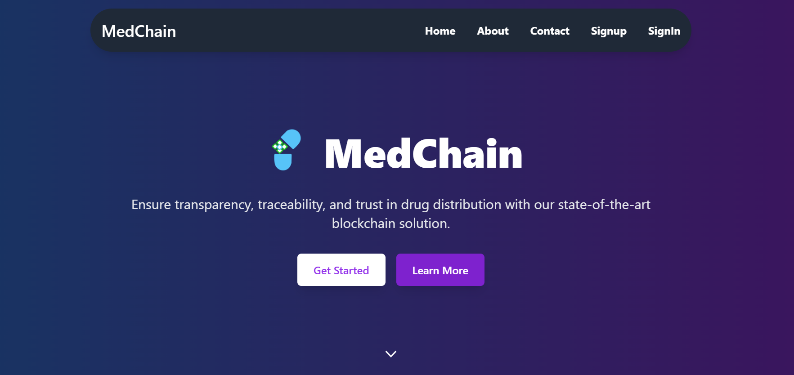
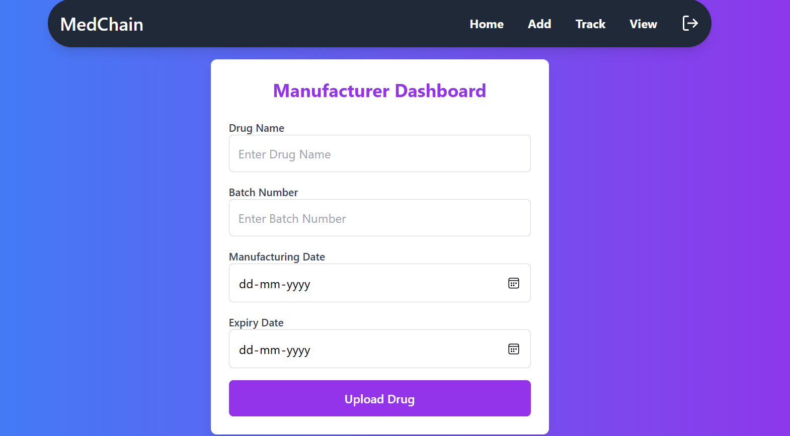
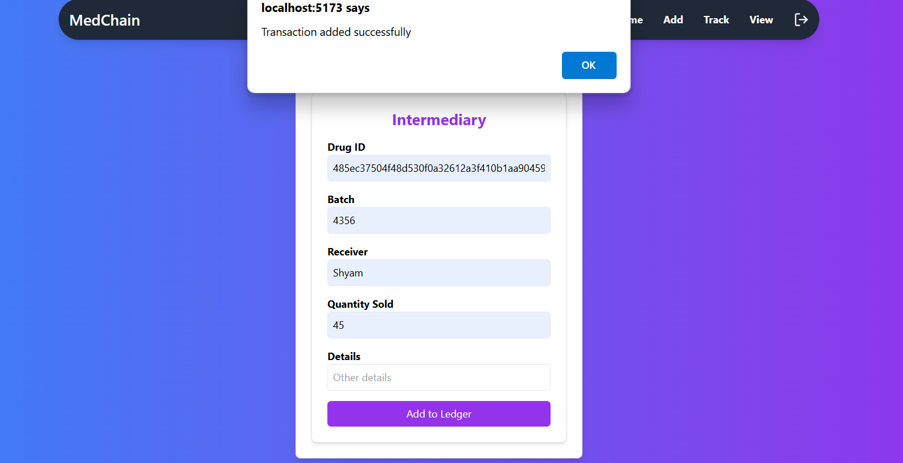
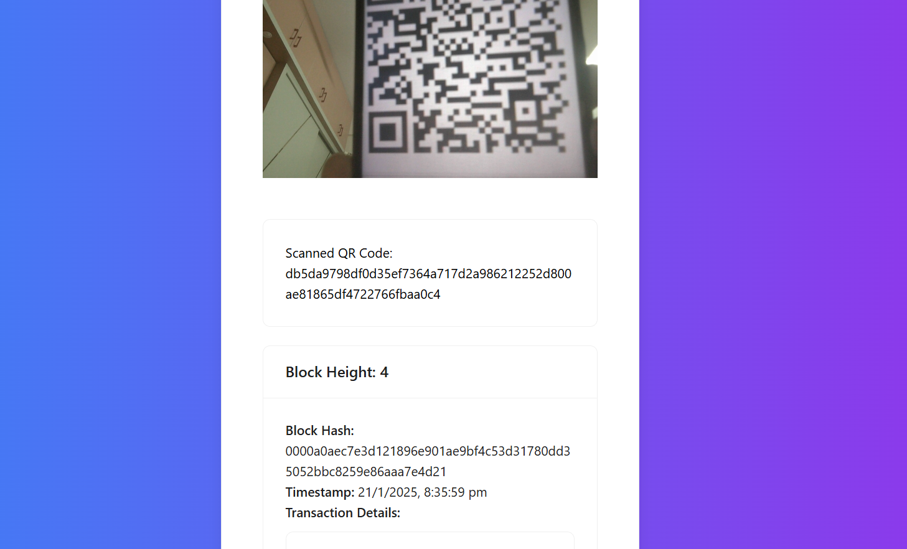

# **MedChain - Blockchain-Based Drug Supply Chain Management** 💊🔗  

## **Overview**  
**MedChain** is a decentralized and transparent **drug supply chain management system** powered by **blockchain technology**. It ensures **authenticity, traceability, and security** in the pharmaceutical supply chain, reducing counterfeit drugs and improving regulatory compliance.  

## **Key Features**  
✅ **End-to-End Traceability** – Tracks drugs from manufacturers to end consumers.  
✅ **Tamper-Proof Records** – Uses blockchain for **immutable** and **secure** data storage.  
✅ **Real-Time Monitoring** – Provides live updates on drug movement and conditions.  
✅ **QR Code based drug tracking** – QR code simplifies drug tracking.
✅ **Decentralized & Transparent** – Eliminates intermediaries, reducing fraud and inefficiencies.  

## **Tech Stack**  
- **Blockchain:** Python
- **Backend:** Flask  
- **Frontend:** React, TailwindCSS  

## **How It Works**  
1. **Manufacturers** register drug batches on the blockchain.  
2. **Distributors** verify and log drug shipments.  
3. **Retailers & Pharmacies** track drug authenticity before selling.  
4. **Consumers** scan a QR code to verify drug legitimacy using blockchain records.

## 📸 Screenshots  
### User Inteface
 

### Manufacturer Dashboard  

Manufacturers can register new drug batches on the blockchain, ensuring end-to-end traceability and authenticity.

### Intermediary Dashboard

Intermediaries can verify, track, and update the status of drug shipments in real-time, ensuring transparency across the supply chain.

### Consumer Dashboard
 
 Consumers can scan a QR code to instantly access detailed information about their medication, including its origin, batch number, and supply chain history.
